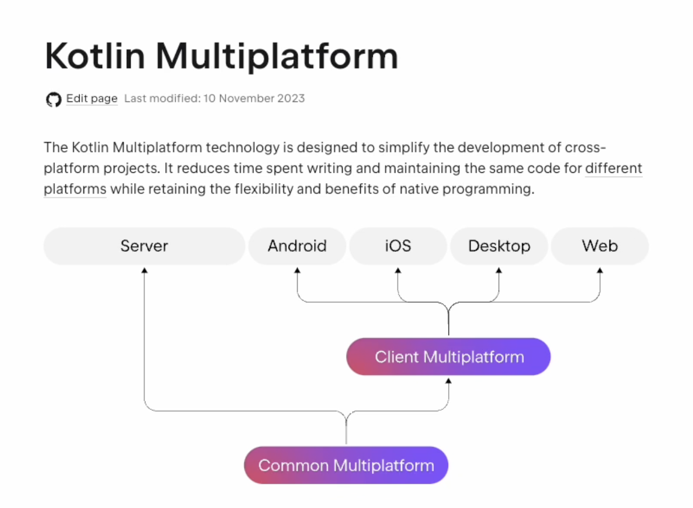
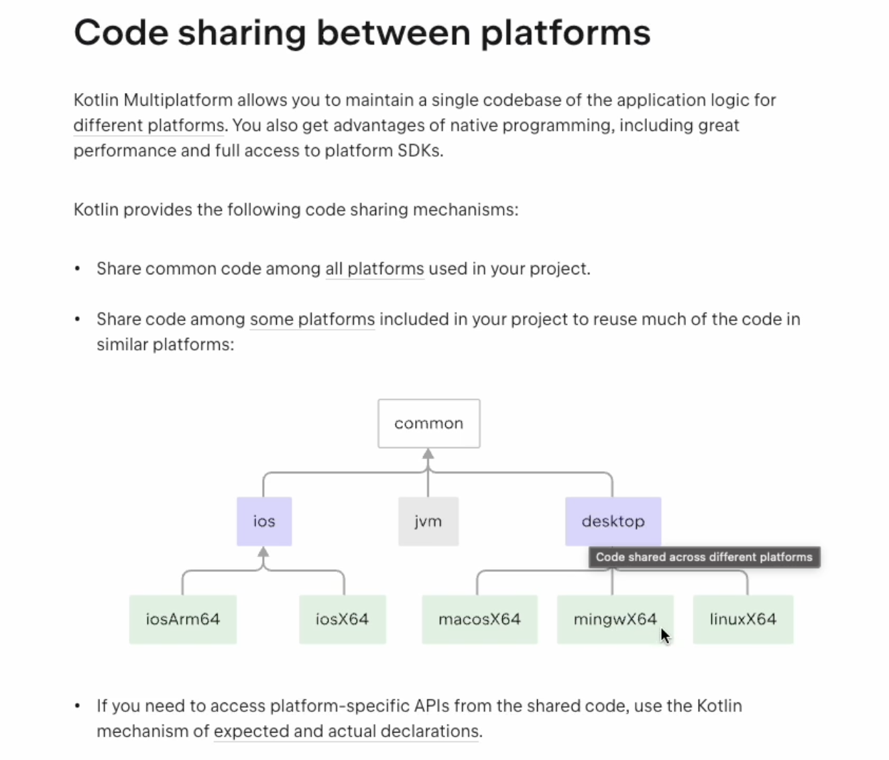
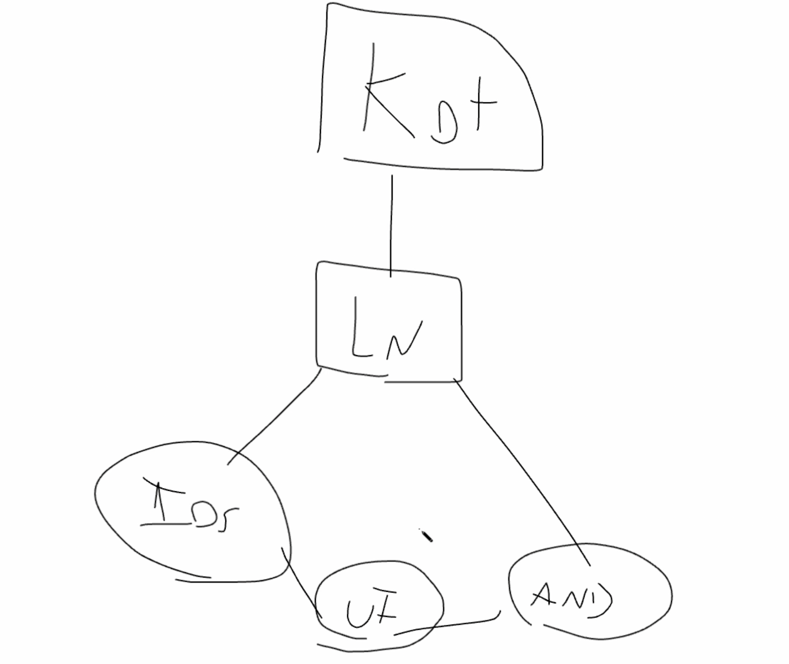
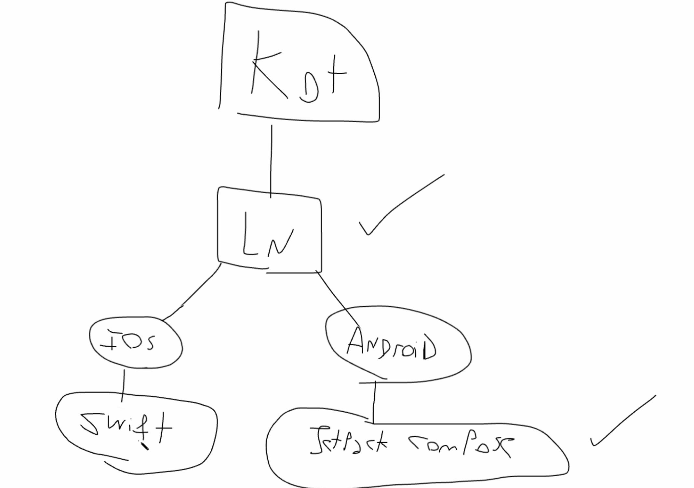

# Kotlin Multiplatform Course

Course: https://www.udemy.com/course/kotlin-multiplataforma-curso-intensivo-para-android-y-ios

## What is Kotlin Multiplatform?

Documentation: https://kotlinlang.org/docs/multiplatform.html

Allow develop apps for android and ios sharing the UI and the bussiness logic

The UI could be shared too, using using Jetpack Compose: https://developer.android.com/compose

Or we can develop the UI on swift for ios and the UI on Jetpack Compose for Android

## Requirements

To be able to develop apps for android and ios it's required to have a Mac.

